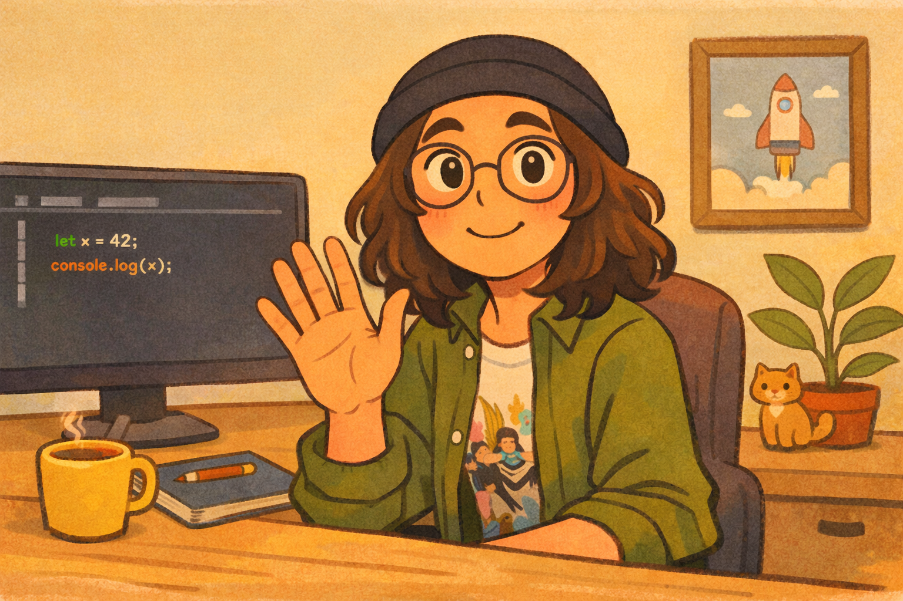

<!-- ============================================ -->
<!-- 🎮 Carlos David Hernandez Collado — README 🎮 -->
<!-- ============================================ -->

  

  

 

  
  
  
  
  

---

## 👨‍💻 About Me

<!-- 🎂 Born in 2003 — update age manually each year, or set up a GitHub Action to auto-update -->

- 🎓 **Computer Science Engineer** from **Pontificia Universidad Católica Madre y Maestra (PUCMM)**, Dominican Republic.
- 🇩🇴 Carlos David Hernandez Collado, **<!-- BIRTHDAY_AGE -->22<!-- /BIRTHDAY_AGE --> years old**.
- 🔍 Actively seeking opportunities to grow professionally, contribute my fast-learning ability, and develop new skills.
- 🤖 Passionate about **Artificial Intelligence**, NLP, and data-driven solutions.
- 🎮 Video game enthusiast: many of my personal projects are inspired by games I've played!
- 🌐 Contributed to the development of [cdes.do](https://cdes.do) as part of the **Consejo para el Desarrollo Estratégico de Santiago (CDES)**.
- ⚡ Team player with strong communication, leadership, and problem-solving skills.

---

## 🛠️ Tech Stack

### 💻 Programming Languages

  
  
  
  
  
  
  

### 🎨 Frontend & Mobile

  
  
  
  
  

### 🗄️ Databases

  

### 🤖 AI & Data

  
  
  
  
  

### 🧰 Tools

  
  
  
  

---

## 🧠 Soft Skills

`Leadership` · `Teamwork` · `Fast Learner` · `Assertive Communication` · `Flexibility & Adaptability` · `Problem Solving` · `Punctuality`

---

## 💼 Experience

| Role | Organization | Description |
|------|-------------|-------------|
| 🌐 **Web Developer** (Project) | **Consejo para el Desarrollo Estratégico de Santiago (CDES)** | Part of the development team for the official website [cdes.do](https://cdes.do). |

---

## 📊 GitHub Stats

  
  

  

---

## 🔥 GitHub Streak

  

---

## 🎮 Fun Fact

> *"I turn the games I love into projects I build because the best way to learn is to create something you're passionate about."*

---

  
    
  <strong>✨ Thanks for stopping by. Let's build something awesome! ✨</strong>

